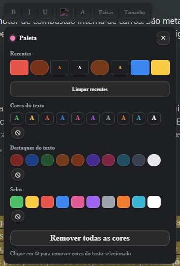
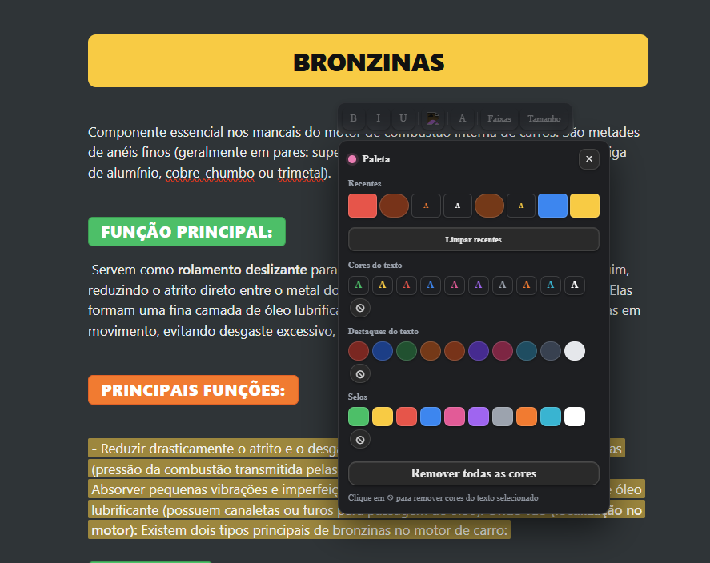

PREVIEW TOOLBAR

**🇧🇷 Versão em Português**

Obsidian Editor HUD (Estilo ClickUp)
Uma barra de ferramentas flutuante, minimalista e poderosa para o Obsidian, inspirada na paleta de cores e produtividade do ClickUp.

O que é este plugin? Este é um script personalizado (para ser usado com o plugin Templater ou como um User Script) que faz aparecer uma barra de ferramentas inteligente sempre que você seleciona um texto. Chega de decorar comandos complexos ou procurar botões escondidos; as opções de formatação aparecem exatamente onde seu mouse está.

Funcionalidades Principais:

Formatação ClickUp-Style: Aplique Badges (selos), Highlights (marca-texto) e cores de texto vibrantes com um clique.

Histórico de Recentes: O HUD lembra as últimas cores e estilos que você usou para facilitar a consistência no seu vault.

Controle de Estrutura: Alinhamento central, faixas coloridas de bloco (Banners) e alternância rápida entre H1, H2 e H3.

Edição Básica: Negrito, Itálico e Sublinhado integrados.

Limpeza Inteligente: Botão para remover todas as formatações de cor e manter apenas o texto puro.

Como contribuir? Este projeto é open-source e nasceu do desejo de ter uma experiência de escrita mais fluida. Se você é bom de CSS, manja de JavaScript ou tem ideias de como tornar a toolbar mais bonita e compacta, sinta-se à vontade!

Faça um Fork.

Melhore o código ou o design.

Mande um Pull Request. Qualquer ajuda para aperfeiçoar a ferramenta é muito bem-vinda!

**🇺🇸 English Version**

Obsidian Editor HUD (ClickUp Style)
A minimalist and powerful floating toolbar for Obsidian, inspired by ClickUp's productivity-focused color palette and UI.

What is this plugin? This is a custom script (designed for use with Templater or as a User Script) that triggers a smart toolbar whenever you select text. No more memorizing complex markdown or hunting for hidden buttons; formatting options appear right where your cursor is.

Key Features:

ClickUp-Style Formatting: Apply vibrant Badges, Highlights, and Text Colors with a single click.

Recent Items History: The HUD remembers your most used styles for quick access and consistency across your vault.

Structural Control: Center alignment, block-level colored banners ("Faixas"), and quick toggles for H1, H2, and H3.

Essential Editing: Integrated Bold, Italic, and Underline tools.

Smart Clean-up: A dedicated button to strip all color formatting while preserving your content.

How to contribute? This is an open-source project born from the need for a smoother writing experience. If you are a CSS wizard, a JavaScript pro, or have ideas on how to make the toolbar even more elegant and compact, please join in!

Fork the repo.

Improve the code or the UI/UX.

Submit a Pull Request. Any contribution to make this tool better for the community is highly appreciated!

**🇧🇷 Como Instalar**

Para o correto funcionamento do HUD e de todas as suas funcionalidades de formatação (badges, highlights, etc.), siga os passos abaixo:

1. Configuração do CSS (Estilos)
Baixe o arquivo cores-basicas.css.

No seu vault do Obsidian, navegue até a pasta oculta .obsidian/snippets.

Cole o arquivo cores-basicas.css lá.

No Obsidian, vá em Configurações > Aparência e, na seção Snippets de CSS, ative o arquivo cores-basicas.

2. Configuração dos Scripts (Lógica)
O sistema utiliza um script principal para o HUD e diversos mini-scripts auxiliares para aplicar as cores e estilos.

Crie uma pasta chamada scripts na raiz do seu vault (caso ainda não exista).

Baixe o arquivo editor-hud.js e todos os outros arquivos .js (os mini-scripts de badges, highlights e cores) e coloque-os dentro dessa pasta scripts.

Para usuários do Templater:

Configure a pasta de scripts em Settings > Templater > User Script Functions.

O HUD principal (editor-hud.js) invocará os mini-scripts conforme necessário para aplicar as formatações.

O HUD aparecerá automaticamente sempre que você selecionar um texto no editor.

**🇺🇸 How to Install**

To ensure the HUD and all its formatting features (badges, highlights, etc.) work correctly, follow these steps:

1. CSS Setup (Styles)
Download the cores-basicas.css file.

In your Obsidian vault, navigate to the hidden folder .obsidian/snippets.

Paste the cores-basicas.css file there.

In Obsidian, go to Settings > Appearance, find the CSS Snippets section, and toggle the switch for cores-basicas.

2. Scripts Setup (Logic)
The system uses a main HUD script and several auxiliary mini-scripts to apply colors and styles.

Create a folder named scripts at the root of your vault (if it doesn't already exist).

Download the editor-hud.js file and all other .js files (the mini-scripts for badges, highlights, and colors) and place them inside this scripts folder.

For Templater users:

Define your scripts folder in Settings > Templater > User Script Functions.

The main HUD (editor-hud.js) will invoke the mini-scripts as needed to apply the formatting.

The HUD will automatically appear whenever you select text within the editor.
